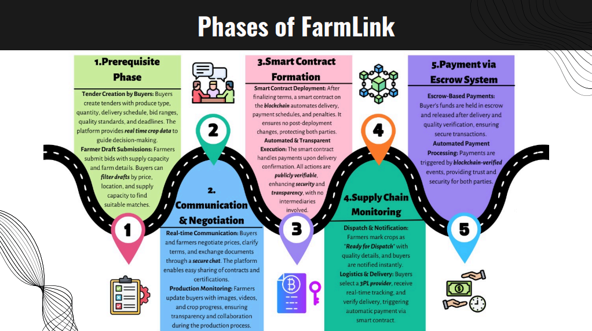
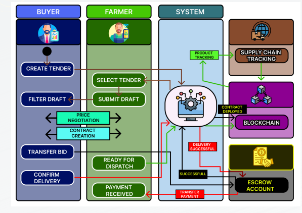
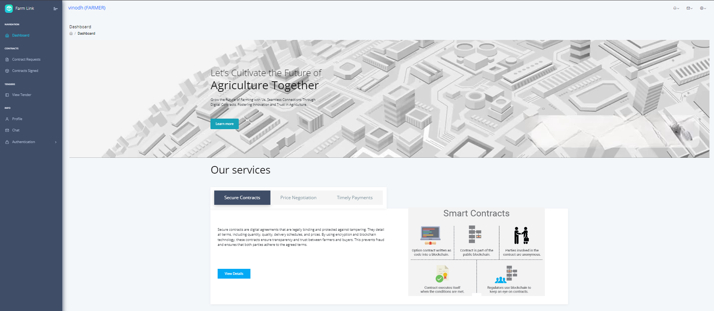

This project proposes a blockchain-based platform to enhance contract farming by enabling direct, secure, and transparent interactions between farmers and buyers.

The platform eliminates intermediaries, supports various transaction models, and includes tools for negotiation, fraud prevention, and automated payments.

With features like linguistic support and customer assistance, it ensures fairness, protects against exploitation, and promotes sustainable agriculture.

**Phases of Farmlink**

**Workflow of Farmlink**

**UI of Farmlink**

